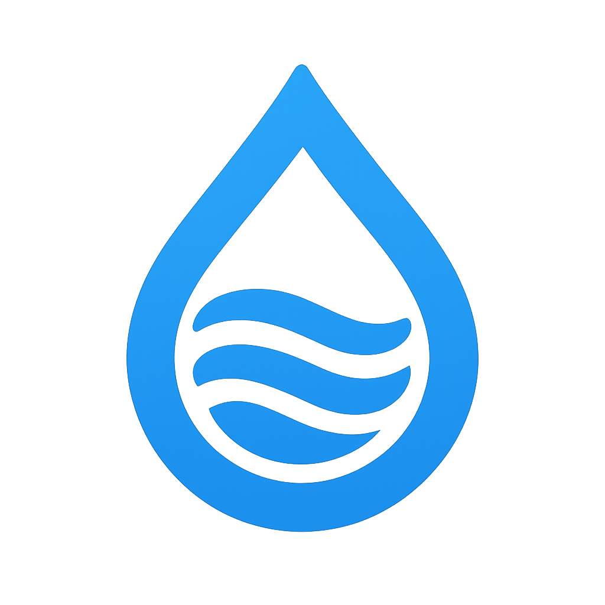

# 💧 Aqualy - Sistema Inteligente de Monitoramento de Água

<div align="center">



**Automação hídrica para Smart Homes • Monitoramento com IA • Controle inteligente**

[](https://unitins.br)
[](https://flutter.dev)
[](https://quarkus.io)
[](https://www.espressif.com)

</div>

---

## 📖 Sobre o projeto

O **Aqualy** é uma solução inovadora de **automação hídrica para casas inteligentes** que integra hardware IoT, backend robusto e aplicação móvel. Desenvolvido para o **HACKÁGUA - UNITINS**, o sistema preenche uma lacuna importante no mercado de smart homes: enquanto a maioria das soluções inteligentes foca em automação elétrica, o Aqualy traz **inteligência e automação para a gestão de água**.

### 🎯 Diferencial

**Automação hídrica inteligente** — Monitoramento em tempo real, insights gerados por IA e controle automático do fluxo de água para casas inteligentes, promovendo consumo consciente e sustentável.

---

## 🏗️ Arquitetura

O sistema é composto por **três camadas** que trabalham de forma integrada:

```
 SENSOR (ESP32)  →  BACKEND (Quarkus)  →  APP (Flutter)
 Mede vazão         Processa dados         Exibe ao usuário
 Controla relé      Gera insights IA       Envia comandos
 Envia via WS       Armazena histórico     Interface móvel
```

| Componente | Tecnologias | Documentação |
|------------|-------------|--------------|
| **📱 App Mobile** | Flutter, FlutterFlow | [→ Ver detalhes](./aqualy-app/README.md) |
| **⚙️ Backend API** | Quarkus, Java, PostgreSQL, Google Gemini | [→ Ver detalhes](./aqualy-backend/README.md) |
| **🔧 Sensor IoT** | ESP32, Sensor YF-S201, WebSocket SSL | [→ Ver detalhes](./aqualy-sensor/README.md) |

---

## ⚡ Como executar

```bash
# 1. Clonar repositório
git clone https://github.com/giseleveloso/hackagua.git
cd aqualy

# 2. Backend (porta 10017)
cd aqualy-backend && ./mvnw quarkus:dev

# 3. App Mobile
cd aqualy-app && flutter run

# 4. Sensor ESP32
# Upload via Arduino IDE (ver documentação do sensor)
```

**📚 Documentação detalhada:** [Backend](./aqualy-backend/README.md) • [App](./aqualy-app/README.md) • [Sensor](./aqualy-sensor/README.md)

---

## 💡 Funcionalidades

- 📈 **Monitoramento em tempo real** — Vazão instantânea e consumo acumulado de todos os pontos da casa
- 🧠 **Inteligência Artificial** — Análise de padrões, detecção de anomalias e sugestões de economia
- ⚙️ **Automação inteligente** — Controle remoto e interrupção automática por limite ou horário
- 📊 **Relatórios detalhados** — Histórico, gráficos e comparativos de consumo
- 🚨 **Alertas em tempo real** — Notificações de vazamentos, consumo excessivo e limites atingidos

---

## 🔬 Tecnologias e Inovação

**Hardware IoT:** Sensor de vazão YF-S201 integrado com ESP32, comunicação WebSocket SSL segura  
**Backend escalável:** API REST em Quarkus (Java), processamento em tempo real, banco PostgreSQL  
**IA integrada:** Google Gemini para análise preditiva e sugestões personalizadas  
**App nativo:** Flutter multiplataforma com interface moderna e responsiva

**Diferencial:** Primeira solução de automação hídrica completa para smart homes no mercado brasileiro, integrando hardware, software e inteligência artificial em uma única plataforma.

---

## 👥 Equipe

**Cauã Fernandes** • **Dejanildo Júnior** • **Gisele Veloso** • **João Víttor Costa** • **Thalyssa Freitas**

Universidade Estadual do Tocantins (UNITINS)

---

## 📄 Licença

Projeto desenvolvido para fins acadêmicos no contexto do **HACKÁGUA - UNITINS**.

---

<div align="center">

### 💧 UNITINS - HACKÁGUA 💧

**Tecnologia e sustentabilidade para um futuro mais consciente**

</div>